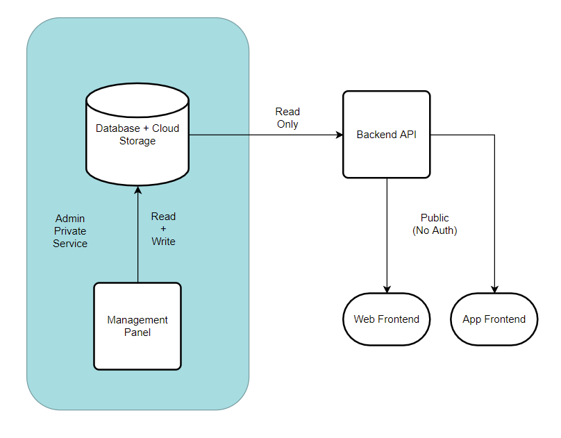

# Backend API for MBtS Site

_Designed By : Saumya Bhatt_

## Architecture

A control panel would be responsible for performing CRUD operations onto the database which would be mapped with cloud storage to host images. Authentication provided by Google OAuth feature of Firebase.

The backend API would allow only read operations on the database with its endpoints providing solutions for complex queries required for Frontend. Authentication done using inbuilt credentials file.

Frontend (web + app) would simply perform get requests from API without any need for authentication, thus making the API publically available.

## Database Schema

_Database Type : *NoSQL*_

_Serverless Database : FirebaseDB_

_Cloud Storage : Firestore_

_Link : [Database Schema](https://dbdiagram.io/d/609fc8c5b29a09603d14fc64)_

Two tables used. One containing information about film and another about short films. Their details can be found out in the above link or from below

The _id_'s are primary keys and will be auto-incremented. Posters would be stored in Firestore whose corresponding link would be stored as links under _img_blob_

<table>
<tr><th>Movies Table</th><th>shortFilms Table</th></tr>
<tr><td>

| Key        |     Type |
| :--------- | -------: |
| id         |      int |
| name       |  varchar |
| review     |  varchar |
| director   |  varchar |
| actor      |  varchar |
| year       |      int |
| amazon     |  boolean |
| netflix    |  boolean |
| instagram  |  boolean |
| acting     |    float |
| story      |    float |
| execution  |    float |
| profundity |    float |
| overall    |    float |
| genre1     |  varchar |
| genre2     |  varchar |
| poster     | img_blob |
| trailer    |  varchar |

</td><td>

| Key         |      Type |
| :---------- | --------: |
| id          |       int |
| name        |   varchar |
| director    |   varchar |
| description |   varchar |
| genre1      |   varchar |
| genre2      |  varcchar |
| instagram   |   boolean |
| duration    | timestamp |
| link        |   varchar |
| poster      |  img_blob |

</td></tr> </table>
